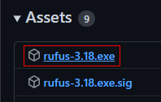
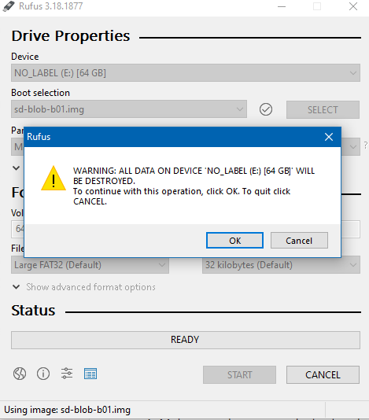
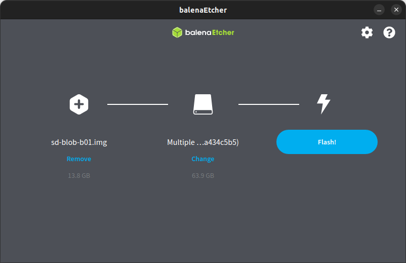

First, you need to download the Jetson's operating system. A custom image with a baseline AVR software can be found here [avr23.zip](https://avr2023storage.blob.core.windows.net/avr-drone/avr23new.zip).
This is a large file, so it will take a while.

After the `.zip` file finishes downloading, extract this file, and plug in your
microSD card.

## Windows

To flash the SD card on Windows, we recommend a tool called Rufus.
Go to [this page](https://github.com/pbatard/rufus/releases/latest) and download
the `rufus-<version>.exe` file.

Go ahead and launch Rufus.
When you launch the application, it should look something like this:

1. Make sure the correct device is selected. If your microSD card is not blank,
   it will probably have a different label.
2. Select the `.img` file in the folder you extracted.

You will now be able to click the "START" button in Rufus. Go ahead and click this.
You will get a number of warnings that you're about to format and wipe this
microSD card.

Go ahead and click through all of these, you know what you're doing.
Rufus will begin flashing the microSD card and at the end will let you know
when it's finished.

## MacOS/Linux

To flash the SD card on MacOS or Linux, we recommend using Balena Etcher.
Go to [their website](https://www.balena.io/etcher/) and follow
the instructions to download and install Balena Etcher.

Go ahead and launch Balena Etcher.
Select the `.img` file in the folder you extracted, and select your microSD card.

Once you hit "Flash", you may be prompted to enter your password
for super user privileges.

Balena Etcher will begin flashing the microSD card and at the end will let you know
when it's finished.
